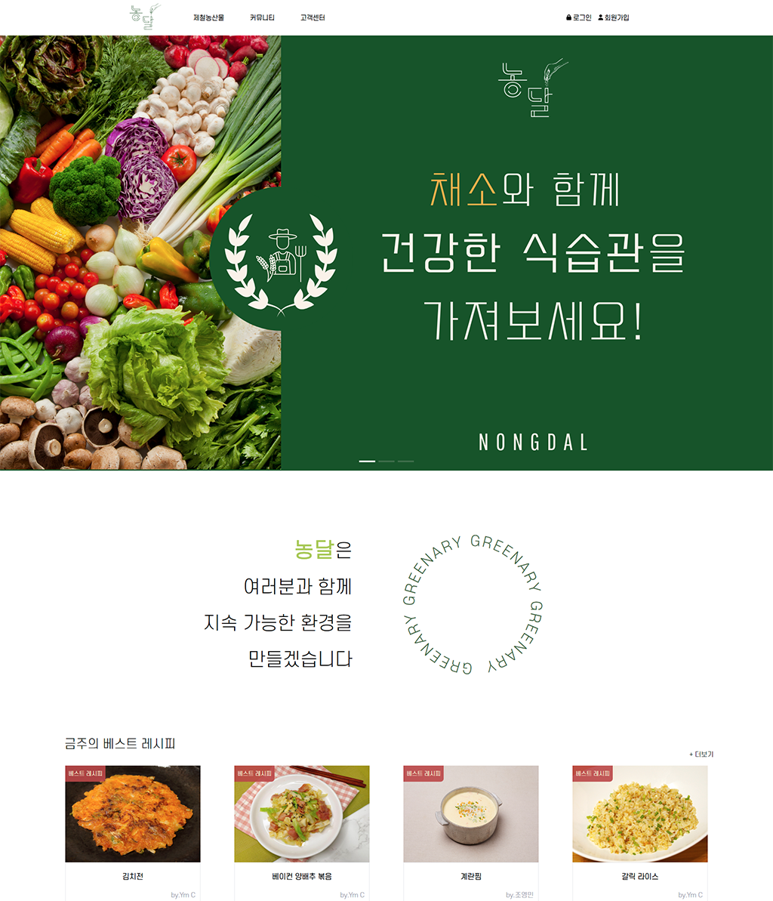
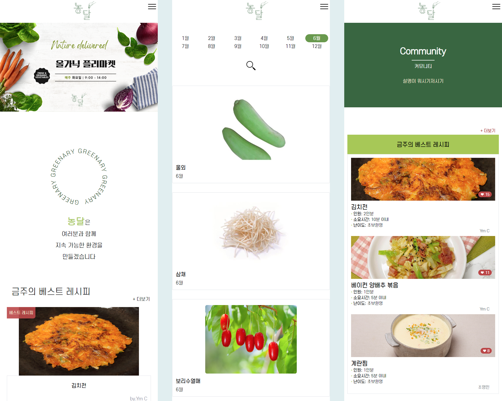

# 제철 농산물 레시피 플랫폼 농달     

## 스크린샷    
  데스크탑 화면  
      
  모바일 화면  
    

## 링크
[https://nongdal.vercel.app/](https://nongdal.vercel.app/)

***

## 프로젝트 소개
### 프로젝트 개요

공공 데이터 API(농림축산식품부 제철 레시피)를 활용하여 제철 농산물을 소개하며, 다양한 농산물들의 조리 방법을 제공하고  
이용자 간에 농산물을 이용한 레시피를 공유하는 커뮤니티형 웹 어플리케이션.

### 프로젝트 제작기간
2023.05.15 ~ 2023.05.29

***
## 기술스택 및 데이터
### STACK
- Vue.js
- Tailwind CSS
- Vue-router
- Swiper.js
- Vuex
- Axios
- Firebase

### 사용 데이터
- [농림수산식품교육문화정보원 제공 제철 농산물 상세정보](https://data.mafra.go.kr/opendata/data/indexOpenDataDetail.do?data_id=20171128000000000925)

***

## 담당파트
- **혁건👑** 
  
  팀장, 프로젝트 생성, API통신, GitHub&Vercel 관리, 이달의 농산물 및 상세페이지, sns 로그인 및 비밀번호 재설정 구현

- **영민👨‍💻**    
  컨텐츠 기획, 사이트 구조 구상,DB 관리(FireBase), 게시판(이벤트, 레시피, 컬럼페이지, 공지사항, QnA) 페이지 구조&(css)제작

- **유상😱**    
  로그인&회원가입 페이지(css)제작, 네비게이션 구조 제작, 반응형 제작, 데이터 출력, 파이어베이스 관리 

- **민아🎨**    
  회의록 작성(Notion), 로고디자인&사이트 디자인&와이어프레임&프로토타입 제작(Figma), css 작업, 메인 홈 데이터 출력, 메인 홈-비주얼 영역 애니메이션, 관리자 접근 권한 설정(router-meta)
  
