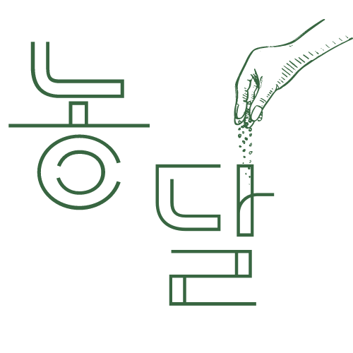

# 프로젝트 이름

   
  팀프로젝트 농달
  
    
   
  

## 프로젝트 소개

프로젝트 개요
 
공공 데이터 API(농림축산식품부 제철 레시피)를 활용하여 제철 농산물을 소개하며,
다양한 농산물들의 조리 방법을 제공하고
이용자 간에 농산물을 이용한 레시피를 공유하는
커뮤니티형 웹 어플리케이션

 

## STACK

Vue
 
TailwindCSs
 
Vue-router
 
Swiper
 
Vuex
 
Axios
 
Firebase

## 담당파트
**혁건👑** - 팀장, 프로젝트 생성, API통신, GitHub&Vercel 관리, 이달의 농산물 및 상세페이지, sns 로그인 및 비밀번호 재설정 구현

**영민👨‍💻** - 컨텐츠 기획, 사이트 구조 구상,DB 관리(FireBase), 게시판(이벤트, 레시피, 컬럼페이지, 공지사항, QnA) 페이지 구조&(css)제작, PPT 제작

**유상😱** - 로그인&회원가입 페이지(css)제작, 네비게이션 구조 제작, 반응형 제작, 데이터 출력, 파이어베이스 관리 

**민아🎨** - 회의록 작성(Notion), 로고디자인&사이트 디자인&와이어프레임&프로토타입 제작(Figma), css 작업, 메인 홈 데이터 출력, 메인 홈-비주얼 영역 애니메이션, 관리자 접근 권한 설정(router-meta)

 

 

